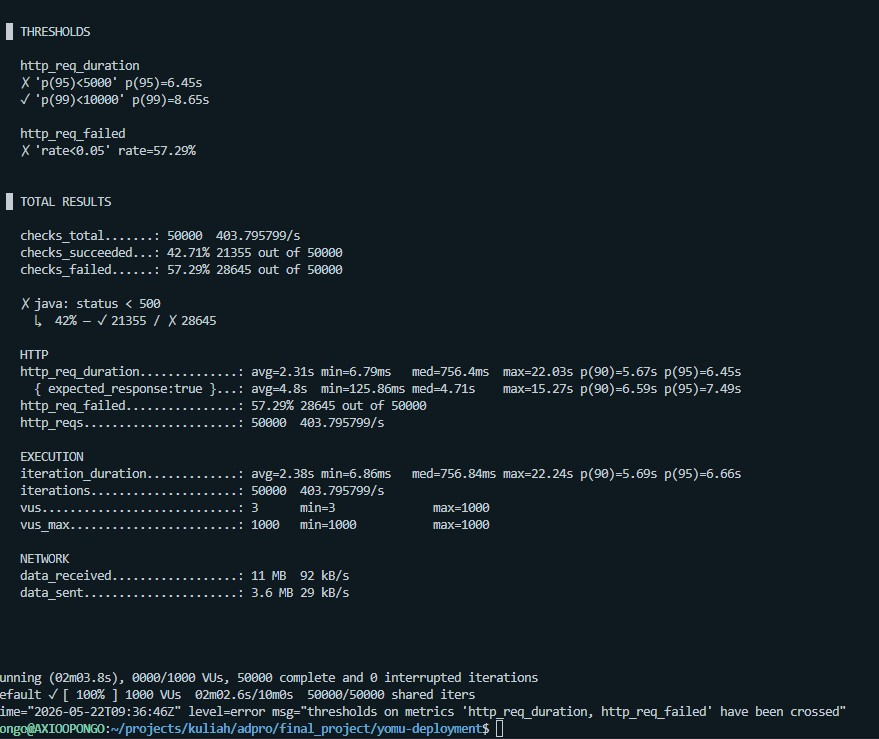
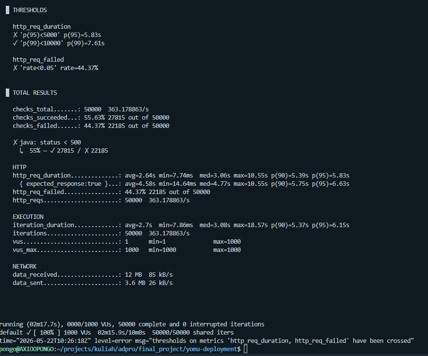
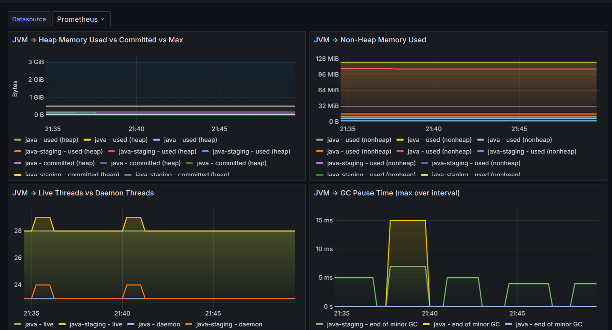

# Yomu Backend Java

Backend utama untuk modul autentikasi, user management, bacaan-kuis, dan integrasi sinkronisasi ke Rust engine.

## QA dan CI

Ringkasan konfigurasi:
- CI: `.github/workflows/ci.yml` menjalankan unit test, functional/API test, dan quality checks.
- Release image: `.github/workflows/release.yml` build dan push Docker image ke GHCR.
- Quality tools: PMD, JaCoCo HTML/XML report, dan JaCoCo coverage verification.
- Functional/API testing: Spring MockMvc controller/integration flow untuk auth, user, forum, bacaan-kuis, security, dan outbox.
- Monitoring: Spring Actuator health/metrics/prometheus, Micrometer, OTEL, HikariCP metrics, dan JSON logging.

## Profiling

Profiling dilakukan pada service Java menggunakan skenario load test 50.000 request dengan 1.000 virtual users (VUs). Tujuan profiling adalah membandingkan performa service sebelum dan sesudah peningkatan resource, terutama pada metrik latency, throughput, dan error rate. Perubahan resource utama yang diuji adalah peningkatan kapasitas dari 1 GB menjadi 2 GB.

### Before: Resource 1 GB



### After: Resource 2 GB



### Ringkasan Hasil

| Metrik | Before 1 GB | After 2 GB | Analisis |
| --- | ---: | ---: | --- |
| Total request | 50.000 | 50.000 | Beban uji sama, sehingga hasil dapat dibandingkan. |
| Virtual users | 1.000 | 1.000 | Concurrency tetap sama. |
| Throughput | 363,18 req/s | 403,80 req/s | Naik sekitar 11,18%, menunjukkan resource tambahan membantu kapasitas proses request. |
| Average latency | 2,64 s | 2,31 s | Membaik sekitar 12,5%, menunjukkan waktu respons rata-rata turun. |
| Median latency | 3,06 s | 756,4 ms | Membaik signifikan, mayoritas request menjadi lebih cepat. |
| p95 latency | 5,83 s | 6,45 s | Memburuk, menunjukkan tail latency masih bermasalah di sebagian request. |
| p99 latency | 7,61 s | 8,60 s | Memburuk, request paling lambat masih terdampak bottleneck. |
| Failed request rate | 44,37% | 57,29% | Memburuk, berarti scaling resource belum cukup untuk menjaga reliability pada beban 1.000 VUs. |
| Successful checks | 27.815 | 21.355 | Turun karena failure rate meningkat. |
| Failed checks | 22.185 | 28.645 | Naik, perlu analisis lanjutan pada endpoint, database, dan dependency eksternal. |

### Justifikasi Proses Profiling

Proses profiling menggunakan load test dengan jumlah request dan virtual users yang sama pada dua kondisi resource. Pendekatan ini valid karena variabel beban dibuat tetap, sedangkan resource aplikasi menjadi variabel pembanding. Dengan begitu, perubahan performa dapat dikaitkan dengan perubahan kapasitas resource dan bottleneck sistem yang muncul saat traffic tinggi.

Metrik yang digunakan juga representatif untuk service backend:

- `http_req_duration` digunakan untuk melihat latency rata-rata, median, p95, dan p99.
- `http_req_failed` digunakan untuk melihat reliability service di bawah beban tinggi.
- `http_reqs` digunakan untuk melihat throughput.
- `checks_succeeded` dan `checks_failed` digunakan untuk memastikan response memenuhi ekspektasi, misalnya status HTTP kurang dari 500.
- `vus` dan `iterations` memastikan beban test berjalan sesuai skenario yang sama.

Hasil profiling menunjukkan bahwa peningkatan resource dari 1 GB ke 2 GB memberi dampak positif pada throughput, average latency, dan median latency. Artinya, sebagian besar request mendapat keuntungan dari resource tambahan. Namun, p95, p99, dan failure rate justru meningkat. Ini menunjukkan bottleneck tidak hanya berasal dari kapasitas resource aplikasi, tetapi kemungkinan juga berasal dari batas concurrency, database connection pool, query database, timeout, integrasi gRPC/REST, atau dependency eksternal.

### Analisis Improvement

Peningkatan resource perlu dipertahankan karena terbukti meningkatkan throughput dari 363,18 req/s menjadi 403,80 req/s dan menurunkan median latency dari 3,06 s menjadi 756,4 ms. Namun, improvement berikutnya harus fokus pada reliability dan tail latency, bukan hanya menambah resource.

Rekomendasi improvement:

1. Optimalkan database connection pool melalui `DB_POOL_MAX_SIZE`, `DB_POOL_MIN_IDLE`, dan timeout HikariCP agar 1.000 VUs tidak menunggu koneksi terlalu lama.
2. Tambahkan index database pada kolom yang sering dipakai filter atau lookup, seperti `user_id`, `article_id`, `comment_id`, dan `reaction_type`.
3. Review query repository yang sering terpanggil saat load test untuk menghindari N+1 query dan query tanpa index.
4. Tambahkan pagination atau limit pada endpoint list, terutama komentar forum dan artikel, agar response tidak terlalu besar saat traffic tinggi.
5. Tambahkan timeout eksplisit dan fallback pada integrasi eksternal, terutama komunikasi gRPC/REST ke Rust Engine.
6. Pisahkan flow sinkronisasi eksternal dari request utama menggunakan outbox atau async processing agar kegagalan service eksternal tidak menaikkan failure rate endpoint utama.
7. Tambahkan custom Micrometer metric untuk latency per endpoint, jumlah error per endpoint, jumlah retry outbox, dan latency call gRPC.
8. Gunakan profiling JVM lanjutan seperti Java Flight Recorder untuk melihat CPU hotspot, garbage collection pause, object allocation, dan thread blocking.
9. Jalankan load test bertahap, misalnya 100, 250, 500, 750, dan 1.000 VUs, untuk menemukan titik mulai terjadinya failure spike.
10. Setelah tuning, ulangi profiling dengan threshold yang sama agar improvement dapat dibuktikan secara kuantitatif.

## Monitoring

Link dashboard monitoring: [https://monitoring.yomu.my.id/login](https://monitoring.yomu.my.id/login)



Monitoring aplikasi menggunakan Grafana dengan datasource Prometheus. Service Java mengekspos metrik runtime melalui Spring Boot Actuator dan Micrometer pada endpoint Prometheus, lalu Prometheus melakukan scraping metrik tersebut. Grafana digunakan sebagai layer visualisasi agar kondisi service dapat dipantau melalui dashboard.

### Justifikasi Desain Monitoring

Desain monitoring ini dipilih karena sesuai dengan karakter service backend Java yang berjalan terus menerus dan perlu dipantau dari sisi availability, resource usage, serta performa runtime JVM.

- Spring Boot Actuator digunakan karena menyediakan endpoint health dan metrics secara standar untuk aplikasi Spring Boot.
- Micrometer digunakan sebagai abstraction layer metrics agar metrik aplikasi dapat diekspor ke Prometheus tanpa membuat collector manual.
- Prometheus digunakan karena cocok untuk menyimpan time-series metrics seperti memory usage, thread count, GC pause, request count, dan latency.
- Grafana digunakan karena memudahkan visualisasi metrik Prometheus dalam bentuk dashboard operasional.
- JVM metrics dipantau karena backend Java sangat dipengaruhi oleh heap memory, non-heap memory, garbage collection, dan jumlah thread.
- Dashboard monitoring dipisahkan dari aplikasi utama agar observability tetap tersedia tanpa mengubah business logic aplikasi.

### Contoh Penggunaan Monitoring

Contoh penggunaan dashboard monitoring:

1. Membuka Grafana melalui [https://monitoring.yomu.my.id/login](https://monitoring.yomu.my.id/login).
2. Memilih datasource `Prometheus`.
3. Memantau panel `JVM - Heap Memory Used vs Committed vs Max` untuk memastikan heap memory tidak mendekati batas maksimum.
4. Memantau panel `JVM - Non-Heap Memory Used` untuk melihat penggunaan metadata class dan memory runtime non-heap.
5. Memantau panel `JVM - Live Threads vs Daemon Threads` untuk mendeteksi lonjakan thread yang dapat menandakan bottleneck concurrency.
6. Memantau panel `JVM - GC Pause Time` untuk melihat apakah garbage collection mulai menyebabkan jeda eksekusi yang berdampak ke latency.
7. Saat profiling atau load test berjalan, dashboard digunakan untuk membandingkan perubahan resource dengan dampaknya terhadap memory, thread, dan GC.

Contoh analisis dari dashboard:

- Heap memory terlihat masih berada jauh di bawah batas maksimum, sehingga masalah performa tidak hanya berasal dari kehabisan heap.
- Non-heap memory relatif stabil, sehingga tidak terlihat indikasi pertumbuhan metadata/class loading yang tidak terkendali.
- Jumlah live threads stabil di kisaran puluhan thread, sehingga tidak terlihat thread explosion pada waktu pengamatan.
- GC pause muncul dalam interval kecil, sehingga perlu dipantau bersama hasil profiling p95 dan p99 latency untuk memastikan GC bukan penyebab utama tail latency.

Dengan desain ini, monitoring dapat digunakan untuk validasi hasil profiling. Jika load test menunjukkan latency atau failure rate meningkat, dashboard Grafana membantu menentukan apakah penyebabnya terkait memory, thread, GC, atau perlu dianalisis lebih lanjut pada database, network, dan integrasi eksternal.

## Prerequisites
- Java 21
- Docker Desktop + Docker Compose

## 1) Clone Repository
```bash
git clone <URL_REPO_BACKEND>
cd yomu-backend-java
```

## 2) Set Environment Variables
Buat file `.env` di root project:

```env
DB_PASSWORD=your_db_password
JWT_SECRET=your_min_32_char_secret
INTERNAL_API_KEY=your_internal_api_key
RUST_ENGINE_BASE_URL=http://localhost:8080
GOOGLE_OAUTH_CLIENT_ID=your_google_web_client_id.apps.googleusercontent.com
```

Kegunaan variabel:
- `DB_PASSWORD`: password PostgreSQL.
- `JWT_SECRET`: signing secret JWT untuk endpoint `/api/v1/...`.
- `INTERNAL_API_KEY`: API key untuk komunikasi internal Java -> Rust (`x-api-key`).
- `RUST_ENGINE_BASE_URL`: base URL Rust engine untuk user sync.
- `GOOGLE_OAUTH_CLIENT_ID`: audience validasi Google ID token (disarankan diisi untuk keamanan).

## 3) Jalankan PostgreSQL dengan Docker Compose
```bash
docker compose up -d
docker compose ps
```

Local database sekarang memakai image `postgres:18-alpine` agar konsisten dengan service Rust dan lebih ringan untuk development. Konfigurasi database, port, username, dan nama database tetap sama seperti setup PostgreSQL 15, jadi output aplikasi seharusnya tetap setara selama schema dan env tidak berubah.

Jika sebelumnya pernah menjalankan PostgreSQL 15 di volume lokal yang sama, reset volume saat migrasi major version:

```bash
docker compose down -v
docker compose up -d
```

Container database expose port:
- Host: `localhost:5433`
- Container: `5432`

## 4) Jalankan Backend
```bash
./gradlew bootRun
```

Windows PowerShell:
```powershell
./gradlew.bat bootRun
```

Jika port `8080` terpakai:
```bash
./gradlew bootRun --args="--server.port=8081"
```

Windows PowerShell:
```powershell
./gradlew.bat bootRun --args="--server.port=8081"
```

## 5) Verifikasi Build dan Test
```bash
./gradlew test
```

Windows PowerShell:
```powershell
./gradlew.bat test
```

## 6) Alur Kolaborasi Tim Setelah Merge ke `main`
Jika branch auth/infrastruktur sudah merge ke `main`, anggota tim modul lain wajib mulai dari state terbaru agar integrasi tidak patah.

Langkah kerja standar per anggota:
1. Sinkronkan branch lokal:
```bash
git checkout main
git pull origin main
```
2. Buat branch fitur modul masing-masing:
```bash
git checkout -b feature/<nama-modul-anda>
```
3. Jalankan backend dan test dulu untuk memastikan baseline hijau:
```bash
./gradlew test
./gradlew bootRun
```
4. Kerjakan fitur secara modular di package sendiri (contoh: `kuis`, `modul-x`) tanpa ubah kontrak global auth.
5. Pastikan endpoint modul mengikuti kontrak response dan security (lihat bagian "Kontrak Integrasi Wajib").
6. Sebelum push, jalankan test lagi:
```bash
./gradlew test
```
7. Push branch + buat PR ke `main`.

## 7) Kontrak Integrasi Wajib untuk Semua Modul
Semua modul baru (termasuk `kuis`) harus kompatibel dengan fondasi auth yang sudah ada.

Aturan wajib:
- Semua response API wajib wrapper: `{"success":..., "message":..., "data":...}`.
- JSON menggunakan `snake_case`.
- Jangan return raw array/object dari controller.
- Endpoint publik gunakan prefix `/api/v1/...`.
- Endpoint yang butuh login harus memakai JWT `Authorization: Bearer <token>`.
- Untuk akses user login, gunakan helper security/context yang sudah ada (bukan parsing token manual di controller).
- Untuk kasus error, lempar custom exception agar ditangani global exception handler (jangan HTML error default).

Contoh integrasi modul `kuis` setelah pull:
- Jika endpoint `kuis` butuh user login, tempatkan di `/api/v1/...` dan biarkan security filter existing memverifikasi JWT.
- Jika butuh `user_id` login, ambil dari `CurrentUser` di service layer.
- Jika modul perlu sinkronisasi lintas service, gunakan pola outbox agar gagal integrasi tidak merusak transaksi utama.

## 8) Penggunaan di Luar Repo (Consumer Integration)
Bagian ini untuk tim lain di luar repo Java (frontend, Rust service, QA).

Frontend / Client API:
- Login lokal: `POST /api/v1/auth/login`.
- Register lokal: `POST /api/v1/auth/register`.
- Login Google: `POST /api/v1/auth/google`.
- Profile saat ini: `GET /api/v1/users/me`.
- Update akun: `PATCH /api/v1/users/me`, `PATCH /api/v1/users/me/password`, `PATCH /api/v1/users/me/login-identifiers`.
- Delete akun: `DELETE /api/v1/users/me`.
- Batch user lookup: `GET /api/v1/users/batch?ids=...`.
- Forum: `GET /api/v1/forums/{article_id}/comments`, `POST /api/v1/forums/{article_id}/comments`, `POST /api/v1/forums/comments/{comment_id}/reactions`.

Rust engine integration:
- Endpoint internal Rust dipanggil dari Java: `POST {RUST_ENGINE_BASE_URL}/api/internal/users/sync`.
- Header wajib: `x-api-key: <INTERNAL_API_KEY>`.
- Jika Rust down/timeout, Java tetap sukses ke client dan simpan event ke outbox (`failed_sync_events`).

Admin operational flow:
- `GET /api/v1/admin/failed-sync-events` untuk lihat event gagal.
- `POST /api/v1/admin/failed-sync-events/retry` untuk retry manual.
- Scheduler retry otomatis jalan tiap 5 menit untuk status `FAILED/PENDING` (bisa dikontrol lewat config).

## 9) Load Balancer dan Replikasi Container Java
Service Java aman untuk load balancing karena auth menggunakan JWT stateless. Semua instance wajib memakai env secret/config yang sama: `JWT_SECRET`, `INTERNAL_API_KEY`, `GOOGLE_OAUTH_CLIENT_ID`, dan `RUST_ENGINE_BASE_URL`.

Konfigurasi aplikasi yang mendukung deployment multi-instance tanpa Kubernetes:
- Jalankan beberapa instance web Java di balik reverse proxy/load balancer seperti Nginx, Caddy, HAProxy, atau load balancer bawaan PaaS.
- `OUTBOX_SCHEDULER_ENABLED=false` untuk semua instance web biasa.
- `OUTBOX_SCHEDULER_ENABLED=true` hanya untuk satu instance scheduler agar retry outbox tidak berjalan paralel dari banyak instance.
- `DB_POOL_MAX_SIZE` dihitung dari budget koneksi PostgreSQL: `jumlah_instance * DB_POOL_MAX_SIZE`.
- `CORS_ALLOWED_ORIGINS` diisi domain frontend yang mengakses backend lewat reverse proxy/load balancer.
- Health check web/readiness: `/actuator/health/readiness`.
- Health check liveness: `/actuator/health/liveness`.

Untuk deployment sederhana, gunakan `docker-compose.yml` sebagai baseline lokal/staging, lalu pisahkan service web dan scheduler di platform production dengan environment variable yang berbeda.

## 10) Struktur Folder dan Fungsinya
Folder penting di `src/main/java/id/ac/ui/cs/advprog/yomubackendjava`:

- `auth`: login/register/google auth dan issuance JWT.
- `security`: filter JWT, security config, handler 401/403, helper current user.
- `user`: endpoint profile, update account, batch user lookup, mapper user DTO.
- `bacaankuis`: domain fitur bacaan/kuis.
- `forum`: domain fitur diskusi & komentar artikel.
- `outbox`: pencatatan failed sync event, retry service, scheduler retry.
- `integration`: adapter client ke service lain.
- `admin`: endpoint operasional admin (monitor/retry outbox).
- `common`: wrapper response, exception global, util/config shared lintas modul.
- `health`: endpoint health check.

## 11) Apakah Fondasi Ini Bisa Dipakai untuk Fitur Tambahan?
Ya, fondasi ini memang dibuat reusable.

Yang bisa langsung dipakai ulang:
- Wrapper response + exception handler global untuk modul baru.
- JWT security untuk endpoint user/admin.
- Outbox + retry flow untuk integrasi ke service eksternal lain, bukan hanya Rust user sync.
- Batch endpoint pattern untuk kebutuhan aggregasi data modul lain.
- Scheduler retry untuk background recovery task tambahan.

Rekomendasi saat menambah fitur baru:
- Buat package modular baru (contoh: `progress`, `recommendation`, `leaderboard`).
- Pakai kontrak API yang sama agar frontend tidak perlu special case per modul.
- Jika ada call antar service eksternal, pakai pola outbox/fault-tolerance yang sama.
